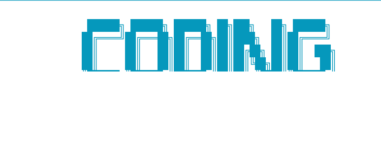

<div align="center">

# Coding Agent

**读它。改它。测它。修它。**

一个能对任意代码库进行**理解、修改、测试、验证**的自主智能体。

[](https://python.org)
[]()
[](LICENSE)
[](https://langchain.com)

[为什么](#为什么) · [快速开始](#快速开始) · [核心能力](#核心能力) · [交互命令](#交互命令) · [架构](#架构)

<br>



</div>

---

## 为什么

普通的 Chatbot 只会「说」。真正的编码智能体要能**读代码、改文件、跑测试、修 bug、再验证**，形成工程闭环。

Coding Agent 把这条闭环做成了基础设施：

- **知道做没做对** — 三层轨迹验证器（结果 / 过程 / 质量），独立 Reviewer 复核
- **能并行、能协作** — 管理者模式拆分任务，多个 Worker 并行执行，一个成功则级联终止
- **从经验中学习** — 每次任务归档为经验，`/evolve` 自动提炼候选规则
- **可观测、可回归** — `/stats` 一眼看清系统状态，`/eval` 让改动不会退化

---

## 快速开始

```bash
git clone https://github.com/231dff/coding-agent.git && cd coding-agent
pip install -e .
coding-agent init           # 首次配置模型
cd /path/to/your/project
coding-agent "解释这个项目的模块结构"
```

> **前置要求**：Python 3.11+ · Docker Engine · 任意 OpenAI 兼容模型的 API Key

---

## 核心能力

| 能力 | 说明 |
|------|------|
| **代码理解** | Tree-sitter 解析 → 依赖图 / 调用图 / 影响分析，改前先看谁会被影响 |
| **自主修改** | 事务式多文件修改，要么全成功，要么全回滚 |
| **沙箱执行** | Docker 隔离 + 默认断网 + 内存/CPU 限制，`rm -rf` 伤不到宿主 |
| **测试闭环** | 写操作后自动跑 `run_tests`，失败信息注入上下文，Agent 自主修复 |
| **独立审查** | `review_changes` 让 Reviewer 看 git diff + 测试结果，独立于主 Agent 判断 |
| **交付报告** | 任务结束生成结构化 Markdown：改动文件 / 测试结果 / 审查结论 |
| **并行执行** | `spawn_workers` 分解独立子任务，一个成功则级联终止其余 |
| **持续进化** | 经验归档 → `/evolve` 提炼规则 → 人工审核后写入系统提示 |
| **可观测** | `/stats` 汇总任务成功率、工具使用频次、按模型成本 |
| **回归测试** | `/eval` 从历史经验挖案例，跑当前版本与 baseline 对比 |

---

## 交互命令

```
/help                    查看全部命令
/thinking                查看最近一次任务的思考过程
/stats                   运行统计（成功率 / 工具 / 成本）
/eval mine|list|run      回归测试：挖案例 / 列案例 / 跑对比
/evolve                  从历史经验生成进化提案
/skills                  列出所有技能
/recall <q>              检索历史会话
/exit                    退出
```

单次任务模式：

```bash
coding-agent "给 calc.py 的 add 函数补 docstring 并加单元测试"
```

---

## 架构

```
┌──────────────────────────────────────────────────────┐
│  接入层    CLI  ·  FastAPI  ·  React Web             │
├──────────────────────────────────────────────────────┤
│  Agent 装配   系统提示 · 工具集 · 中间件链 · 规划图   │
├──────────┬──────────┬──────────┬─────────────────────┤
│ 代码理解  │  沙箱执行 │  中间件   │  可观测性            │
│ 依赖/调用 │  Docker  │ 熔断/压缩 │ 日志/成本/轨迹       │
│ 影响分析  │  事务/补丁│ 指标/缓存 │ 经验/统计/Eval       │
├──────────┴──────────┴──────────┴─────────────────────┤
│  工具层 · 技能层 · MCP 集成 · 上下文管理              │
└──────────────────────────────────────────────────────┘
```

---

## 支持模型

统一走 **OpenAI 兼容接口** + **Anthropic 原生接口**：

> 通义千问 · OpenAI · Claude · DeepSeek · Kimi · 智谱 · Gemini · OpenRouter · Ollama · 自定义

改 `agent/config.yaml` 的 `model` 字段即可切换，无需改代码。

---

## 项目结构

```
coding-agent/
├── agent/          Agent 核心：装配、配置、Provider、规划/修复图
├── codebase/       代码理解：解析、依赖图、调用图、影响分析、检索
├── context/        上下文：装配、预算、压缩、状态栏
├── sandbox/        沙箱：Docker 后端、事务、补丁
├── tools/          工具集（含 review / report / parallel / test 等）
├── middleware/     中间件：熔断、压缩、缓存、轨迹、自动测试
├── memory/         双层记忆：用户卡片 + 会话检索
├── skills/         技能系统
├── mcp_client/     MCP 协议集成
├── observability/  日志、指标、成本、轨迹写入
├── verification/   三层轨迹验证器
├── agent/eval/     回归测试框架
├── agent/stats/    统计面板
├── agent/evolution/ 经验归档 + 进化提案
├── agent/parallel.py 并行 Worker 执行器
├── api/            FastAPI 网关
├── frontend/       React 19 Web 界面
├── evals/          评测框架
├── benchmarks/     基准测试
├── deploy/         Docker Compose 一键部署
└── tests/          pytest 测试套件（230+ 用例）
```

---

## 测试与部署

```bash
# 单元测试
pytest -m "not integration"

# 端到端评测
python -m evals --model qwen:qwen-max

# Docker 部署（Agent + Postgres）
cd deploy && cp .env.example .env && docker compose up -d
```

---

<div align="center">

**⭐ 如果这个项目对你有帮助，欢迎 Star。**

Built with ❤️ and ☕

</div>