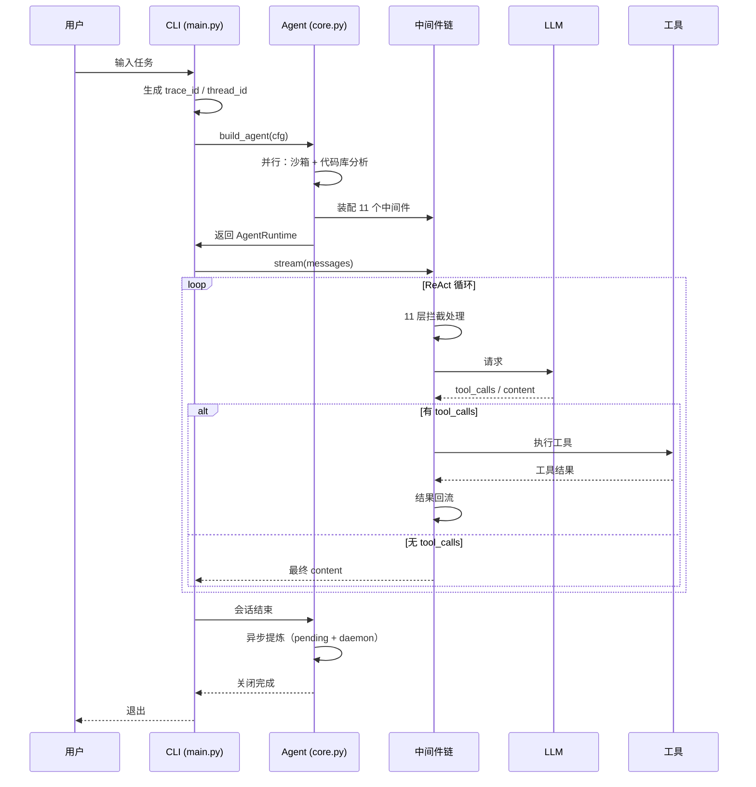

# 架构文档

> 本文档描述 Coding Agent 的整体架构。关键设计决策见
> [`docs/adr/`](adr/)。

## 一、核心公式
Agent = LLM + 上下文 + 工具

对应到本项目的三个抽象：

| 抽象 | 角色 | 代码位置 |
|---|---|---|
| **LLM** | 大脑（决策） | `agent/core.py` 的 `build_llm` |
| **上下文** | 眼睛（感知） | `context/`、`memory/` |
| **工具** | 手脚（执行） | `tools/`、`sandbox/` |

## 二、一次任务的生命周期

### 2.1 顶层流程

1. **CLI 入口**（`agent/main.py`）
   - 解析参数
   - 生成 `trace_id`
   - 解析 `thread_id`（按项目路径生成稳定 ID）

2. **Agent 装配**（`agent/core.py: build_agent`）
   - LLM 初始化
   - 沙箱启动 + 代码库分析（**并行**）
   - 工具集注册（37 个，按字母序稳定）
   - 中间件链装配（11 个）
   - 系统提示装配（含用户卡片）

3. **一次 LLM 调用经过的中间件链**
   - ① `ThinkingRouterMiddleware` —— 判断是否开 thinking
   - ② `ContentStripperMiddleware` —— 清除历史带 `tool_calls` 的 content
   - ③ `RetrievalInjectMiddleware` —— 按当前任务检索历史会话
   - ④ `ContextCompactionMiddleware` —— 接近 80% 窗口时压缩
   - ⑤ `ToolFilterMiddleware` —— 按激活的 skill 过滤工具
   - ⑥ `MetricsMiddleware` —— 记录 token / 成本 / 延迟
   - ⑦ `DependencyCheckMiddleware` —— 修改代码前检查调用方
   - ⑧ `CircuitBreakerMiddleware` —— 连续失败熔断
   - ⑨ `StatusBarMiddleware` —— 注入 `<agent_status>`
   - ⑩ `TrajectoryMiddleware` —— 轨迹持久化（JSONL）
   - ⑪ `PromptCacheMiddleware` —— 缓存标记
   - → **LLM**
   - → 返回 `tool_calls` 或 `content`

4. **工具执行**
   - 文件操作（沙箱内）
   - 事务（多文件原子修改）
   - 代码库分析（依赖图、调用图）
   - 测试（pytest）
   - 子 Agent 委派
   - MCP 工具（Git / Web 搜索）

5. **结果回流**
   - 回到步骤 3 循环
   - **终止条件**：
     - LLM 返回无 `tool_calls` 的 `content`
     - 达到 `max_iterations`（默认 25）
     - 熔断器触发

6. **会话结束**（`agent/main.py`）
   - 写 `pending` 标记
   - 异步提炼卡片 + 摘要（daemon 线程，最多等 1s）
   - 关闭沙箱

### 2.2 时序图（Mermaid）

> 如果你的 Markdown 渲染器支持 Mermaid，会自动渲染成图；
> 不支持则显示为代码块，内容仍然可读。

## 三、核心抽象

### 3.1 运行时

| 抽象 | 职责 | 文件 |
|---|---|---|
| `AgentRuntime` | 一次会话的运行时句柄 | `agent/core.py` |
| `AgentConfig` | 配置（多 Provider） | `agent/config.py` |
| `AgentStatusBar` | 动态状态（工具计数、TODO、cwd） | `context/status_bar.py` |

### 3.2 中间件

所有中间件实现 `langchain.agents.middleware.AgentMiddleware`，通过
`modify_model_request` 或 `wrap_tool_call` 拦截。

| 中间件 | 触发时机 | 作用 |
|---|---|---|
| `ThinkingRouterMiddleware` | 每轮 LLM 前 | 决定是否开 thinking |
| `ContentStripperMiddleware` | 每轮 LLM 前 | 清除历史预告 content |
| `RetrievalInjectMiddleware` | 每轮 LLM 前 | 检索相关历史会话 |
| `ContextCompactionMiddleware` | 每轮 LLM 前 | 五层上下文压缩 |
| `ToolFilterMiddleware` | 每轮 LLM 前 | 按 skill 过滤工具 |
| `MetricsMiddleware` | LLM / 工具调用后 | 记录指标 |
| `CircuitBreakerMiddleware` | 工具调用前后 | 熔断 |
| `StatusBarMiddleware` | 每轮 LLM 前 | 注入状态栏 |
| `TrajectoryMiddleware` | 每轮 LLM / 工具调用 | 轨迹持久化 |
| `PromptCacheMiddleware` | 每轮 LLM 前 | 加缓存标记 |

### 3.3 工具

37 个工具按能力分 6 类：

| 类别 | 工具 | 数量 |
|---|---|---|
| 文件 | `read_file` / `write_file` / `edit_file` / `grep_search` / `glob_files` / `ls_dir` | 6 |
| 沙箱 | `execute` / `sandbox_read` / `sandbox_write` / `sandbox_grep` | 4 |
| 事务 | `begin_transaction` / `tx_edit` / `tx_commit` / `tx_rollback` | 4 |
| 代码库 | `repo_map` / `find_definition` / `find_callers` / `analyze_impact` / `semantic_search` | 8 |
| 测试 | `run_tests` / `run_lint` | 2 |
| 元 / 状态 | `search_tools` / `load_skill` / `update_todo` / `get_status` | 4+ |
| 子 Agent | `delegate_search` / `delegate_analyze` | 2 |
| MCP | Git / Web 搜索 | 动态 |

### 3.4 记忆

**双层架构**（见 ADR-0002）：

| 层 | 存储 | 注入时机 |
|---|---|---|
| **第 1 层**：Advanced JSON Cards | `~/.coding-agent/memory/user_cards.jsonl` | 启动时全量 |
| **第 2 层**：会话摘要 + 检索 | `~/.coding-agent/knowledge/` | 运行时按需 |

**存储后端**（LangGraph Store，见 ADR-0002）：

| 后端 | 用途 |
|---|---|
| `sqlite` | 开发（默认） |
| `postgres` | 生产（多用户） |
| `memory` | 测试 |

**检索器**（见 ADR-0003）：

| 检索器 | 依赖 | 场景 |
|---|---|---|
| `bm25` | 零 | 默认 |
| `chroma` | chromadb | 语义 |
| `hybrid` | chromadb + BM25 | 推荐 |

### 3.5 沙箱

**不池化**（见 ADR-0006）：

- 每次 `acquire` 新建容器
- `release` 只 `stop()`
- 沙箱启动与代码库分析并行

---

## 四、数据流

### 4.1 会话恢复

1. 用户输入
2. `agent/main.py: _default_thread_id(project_path)`
3. `thread_id = md5(project_path)[:12]`
4. `agent/core.py: build_checkpointer(meta_dir)`
5. `SqliteSaver(checkpoints.db)`
6. LangGraph 自动从 `thread_id` 恢复历史 `messages`

### 4.2 记忆写入

1. 用户 `/exit`
2. `agent/main.py: extract_and_save_memory_async`
3. 写 `pending` 标记
4. 启动 daemon 线程：
   - `extract_and_save` → 卡片 → Store
   - `summarize_session` → 摘要 → Store + Chroma
5. 主线程最多等 1 秒

### 4.3 记忆读取

**Agent 启动时**：
1. `agent/core.py: build_agent`
2. 用户卡片 → `system_prompt`（全量）
3. （会话摘要在运行时按需检索）

**每轮 LLM 前**：
1. `RetrievalInjectMiddleware`
2. 用最后一条 user 消息作 query
3. `get_retriever().search()`
4. 结果作为 `HumanMessage` 追加末尾

## 五、扩展点

| 想加什么 | 改哪里 | 参考 |
|---|---|---|
| 新工具 | `tools/xxx_ops.py` + `@tool` + `agent/core.py` 注册 | `tools/file_ops.py` |
| 新中间件 | 继承 `AgentMiddleware` + `agent/core.py` 的 `middlewares` 列表 | `middleware/thinking_router.py` |
| 新 Provider | `agent/providers.py` 加 `ProviderInfo` | 现有 10+ 条 |
| 新 Skill | `skills/definitions/xxx.md` + frontmatter | `skills/definitions/code-review.md` |
| 新记忆后端 | `memory/store.py::create_store` 加分支 | 现有 3 个 |
| 新检索器 | `memory/retriever.py` 继承 `Retriever` | `BM25Retriever` |
| 新卡片类型 | `memory/cards.py::Card` 加字段 | 现有 8 字段 |
| 新评估任务 | `evals/tasks/xxx.py` | 现有任务 |

## 六、关键设计决策

见 [`docs/adr/`](adr/)：

- [ADR-0001](adr/0001-use-sqlite-checkpointer.md)：用 SqliteSaver
- [ADR-0002](adr/0002-two-layer-memory.md)：双层记忆
- [ADR-0003](adr/0003-rrf-hybrid-retrieval.md)：RRF 混合检索
- [ADR-0004](adr/0004-async-extraction-pending.md)：异步提炼 + pending
- [ADR-0005](adr/0005-conditional-thinking.md)：条件化思考
- [ADR-0006](adr/0006-no-sandbox-pooling.md)：沙箱不池化

## 七、性能基线

| 操作 | 目标 | 实测 |
|---|---|---|
| CLI 启动（agent_build） | < 5s | 3-5s |
| 简单任务（"读一下 README"） | < 5s | 4.2s |
| 复杂任务（"为什么"） | < 20s | 15s |
| CLI 退出 | < 1s | < 1s |
| `/recall` 检索 | < 500ms | 60-300ms |

退化 > 20% 时需排查。

## 八、故障排查

| 现象 | 排查步骤 |
|---|---|
| 慢 | 看 `agent_build_done elapsed_s`；看 metrics.db 的 `avg_latency` |
| 报错 | 拿 `trace_id` → 搜日志 → 定位到具体中间件/工具 |
| 沙箱问题 | `docker ps -a --filter label=coding-agent=sandbox` |
| 记忆没生效 | `/memory` 看后端；`/cards` 看卡片数 |
| 复读 | 检查 `ContentStripper` 是否启用 |
| CI 挂 | 看 Actions 具体哪一步失败 |